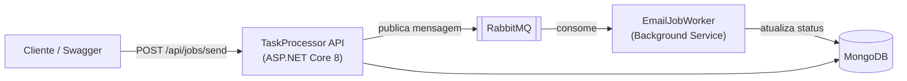

<div align="center">

# 📨 TaskProcessor

**Processamento assíncrono de tarefas e e-mails com .NET 8, RabbitMQ e MongoDB**

[](https://github.com/jvitorsi-dev/TaskProcessor/actions/workflows/ci.yml)
[](https://github.com/jvitorsi-dev/TaskProcessor/actions/workflows/cd.yml)
[](https://dotnet.microsoft.com/)
[](LICENSE)

</div>

## 💡 O problema

Operações que demoram — envio de e-mail, geração de relatórios — não podem travar a resposta de uma API. Este projeto demonstra o padrão **produtor/consumidor**: a API recebe a requisição, publica a tarefa numa fila do **RabbitMQ** e responde imediatamente; um **background worker** processa a tarefa em segundo plano e persiste o status no **MongoDB**.

## ⚙️ Arquitetura



## 📁 Estrutura (Clean Architecture)

```
TaskProcessor.sln
├── TaskProcessor/                 # 🌐 API (controllers, Swagger)
├── TaskProcessor.Application/     # ⚙️ Casos de uso, DTOs, serviços de aplicação
├── TaskProcessor.Domain/          # 📦 Entidades, interfaces e regras de negócio
├── TaskProcessor.Infrastructure/  # 🔌 RabbitMQ, MongoDB, repositórios
├── TaskProcessor.EmailJobWorker/  # 🔄 Background worker (consumidor da fila)
└── TaskProcessor.Tests/           # ✅ Testes com xUnit
```

## 🚀 Como rodar

Pré-requisitos: [Docker](https://www.docker.com/)

```bash
cp .env.example .env      # preencha RABBITMQ_USER e RABBITMQ_PASSWORD
docker compose up --build
```

| Serviço | URL |
|---|---|
| API | http://localhost:5000 |
| Swagger | http://localhost:5000/swagger/index.html |
- RabbitMQ Management (UI de gestão) | http://localhost:15672 

## 🔌 Endpoints

| Método | Rota | Descrição |
|---|---|---|
| `POST` | `/api/jobs/send` | Cria e enfileira um novo job |
| `GET` | `/api/jobs/{id}` | Consulta o status de um job |
| `GET` | `/api/jobs/seed` | Cria um job de exemplo (EmailJob) |

Exemplo:

```bash
curl -X POST http://localhost:5000/api/jobs/send \
  -H "Content-Type: application/json" \
  -d '{"tipo":"EmailJob","dados":"destinatario@exemplo.com"}'
```

## ✅ Testes

```bash
dotnet test
```

Testes de unidade com **xUnit** cobrindo o worker e a resolução de jobs (`JobServiceResolver`, `EmailJobWorker`). O pipeline de **CI roda a suíte de testes a cada push** — veja o badge no topo.

## 🧠 Decisões técnicas

- **Clean Architecture** em camadas (`Domain` não depende de ninguém; `Infrastructure` implementa as interfaces do domínio) — trocar RabbitMQ por outra fila não altera a regra de negócio.
- **Background worker separado** da API: escalam de forma independente e um deploy não derruba o outro.
- **MongoDB** para status dos jobs: escritas rápidas e schema flexível para diferentes tipos de tarefa.
- **`.env.example`** versionado para que qualquer pessoa suba o ambiente em um comando.

## 🗺️ Roadmap

- [ ] Badge de cobertura de testes
- [ ] Retry com política de DLQ (dead-letter queue)
- [ ] Observabilidade com OpenTelemetry
- [ ] Deploy público (demo ao vivo)

## 📄 Licença

Distribuído sob a licença [MIT](LICENSE).
